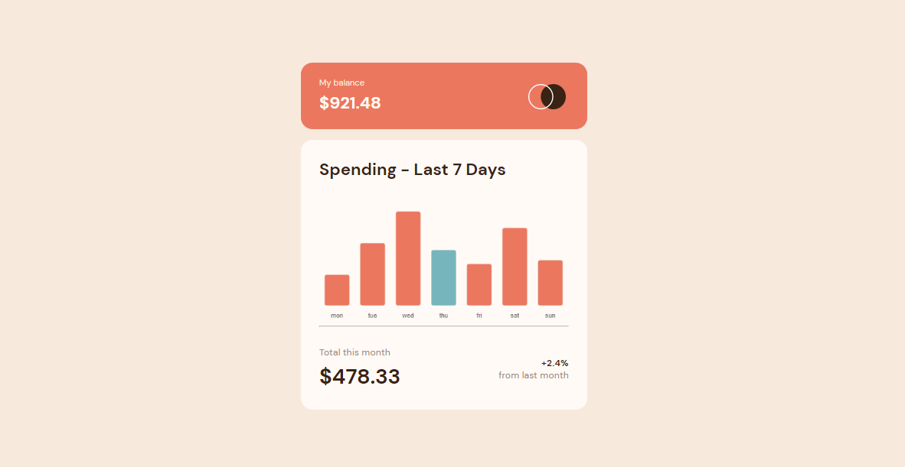
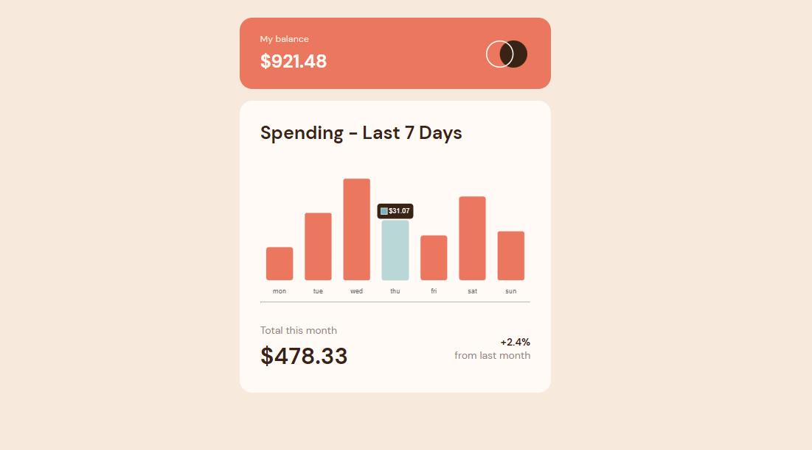
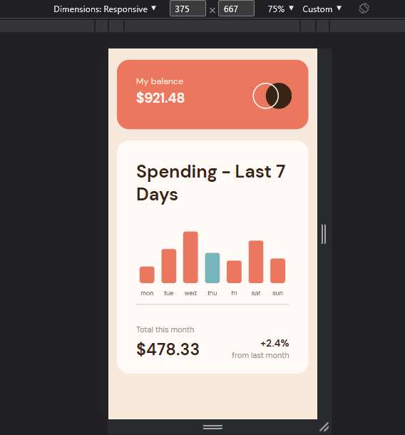

# Frontend Mentor - Expenses chart component solution

This is a solution to the [Expenses chart component challenge on Frontend Mentor](https://www.frontendmentor.io/challenges/expenses-chart-component-e7yJBUdjwt). Frontend Mentor challenges help you improve your coding skills by building realistic projects. 

## Table of contents

- [Overview](#overview)
  - [The challenge](#the-challenge)
  - [Screenshot](#screenshot)
  - [Links](#links)
- [My process](#my-process)
  - [Built with](#built-with)
  - [What I learned](#what-i-learned)
  - [Continued development](#continued-development)
  - [Useful resources](#useful-resources)
- [Author](#author)
- [Acknowledgments](#acknowledgments)
- [Getting Started With Create React App](#getting-started-with-create-react-app)

## Overview

### The challenge

Users should be able to:

- View the bar chart and hover over the individual bars to see the correct amounts for each day
- See the current day’s bar highlighted in a different colour to the other bars
- View the optimal layout for the content depending on their device’s screen size
- See hover states for all interactive elements on the page
- **Bonus**: Use the JSON data file provided to dynamically size the bars on the chart

### Screenshot
- 

- 

- 
### Links
- Live Site URL: [Live Demo](https://expensechart-alaaballoutdev.netlify.app)

## My process

### Built with
- [React](https://reactjs.org/) - JS library
- CSS
- [react-chartjs-2.js](https://react-chartjs-2.js.org/)

### What I learned
This is my first time using Chartjs.

Chart.js is an free JavaScript library for making HTML-based charts. It is one of the simplest visualization libraries for JavaScript, and comes with the following built-in chart types:
  .Scatter Plot
  .Line Chart
  .Bar Chart
  .Pie Chart
  .Donut Chart
  .Bubble Chart
  .Area Chart
  .Radar Chart
  .Mixed Chart

Also Chatjs provides integrations with React, Vue , Angular ...

From this project I learned how to use charts in websites, and how to provide data for these charts, also I learned about styling charts and providing custom options and data.

### Continued development
I am aiming to create admin dashboard with charts in my next project, this will be an interesting challenge for me.

### Useful resources
- [Chartjs](https://www.chartjs.org/)
- [Top 5 React chart libraries](https://blog.logrocket.com/top-5-react-chart-libraries/)
## Author

- Website - [alaaballoutdev.github.io](https://alaaballoutdev.github.io)
- Frontend Mentor - [@alaaballoutdev](https://www.frontendmentor.io/profile/alaaballoutdev)
- LinkedIn - [Alaa Ballout](https://www.linkedin.com/in/alaa-ballout/)

## Getting Started with Create React App

This project was bootstrapped with [Create React App](https://github.com/facebook/create-react-app).

### Available Scripts

In the project directory, you can run:

#### `npm start`

Runs the app in the development mode.\
Open [http://localhost:3000](http://localhost:3000) to view it in your browser.

The page will reload when you make changes.\
You may also see any lint errors in the console.

#### `npm test`

Launches the test runner in the interactive watch mode.\
See the section about [running tests](https://facebook.github.io/create-react-app/docs/running-tests) for more information.

#### `npm run build`

Builds the app for production to the `build` folder.\
It correctly bundles React in production mode and optimizes the build for the best performance.

The build is minified and the filenames include the hashes.\
Your app is ready to be deployed!

See the section about [deployment](https://facebook.github.io/create-react-app/docs/deployment) for more information.

#### `npm run eject`

**Note: this is a one-way operation. Once you `eject`, you can't go back!**

If you aren't satisfied with the build tool and configuration choices, you can `eject` at any time. This command will remove the single build dependency from your project.

Instead, it will copy all the configuration files and the transitive dependencies (webpack, Babel, ESLint, etc) right into your project so you have full control over them. All of the commands except `eject` will still work, but they will point to the copied scripts so you can tweak them. At this point you're on your own.

You don't have to ever use `eject`. The curated feature set is suitable for small and middle deployments, and you shouldn't feel obligated to use this feature. However we understand that this tool wouldn't be useful if you couldn't customize it when you are ready for it.

### Learn More

You can learn more in the [Create React App documentation](https://facebook.github.io/create-react-app/docs/getting-started).

To learn React, check out the [React documentation](https://reactjs.org/).

#### Code Splitting

This section has moved here: [https://facebook.github.io/create-react-app/docs/code-splitting](https://facebook.github.io/create-react-app/docs/code-splitting)

#### Analyzing the Bundle Size

This section has moved here: [https://facebook.github.io/create-react-app/docs/analyzing-the-bundle-size](https://facebook.github.io/create-react-app/docs/analyzing-the-bundle-size)

#### Making a Progressive Web App

This section has moved here: [https://facebook.github.io/create-react-app/docs/making-a-progressive-web-app](https://facebook.github.io/create-react-app/docs/making-a-progressive-web-app)

#### Advanced Configuration

This section has moved here: [https://facebook.github.io/create-react-app/docs/advanced-configuration](https://facebook.github.io/create-react-app/docs/advanced-configuration)

#### Deployment

This section has moved here: [https://facebook.github.io/create-react-app/docs/deployment](https://facebook.github.io/create-react-app/docs/deployment)

#### `npm run build` fails to minify

This section has moved here: [https://facebook.github.io/create-react-app/docs/troubleshooting#npm-run-build-fails-to-minify](https://facebook.github.io/create-react-app/docs/troubleshooting#npm-run-build-fails-to-minify)
